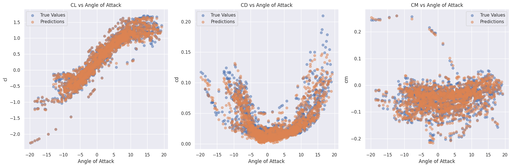
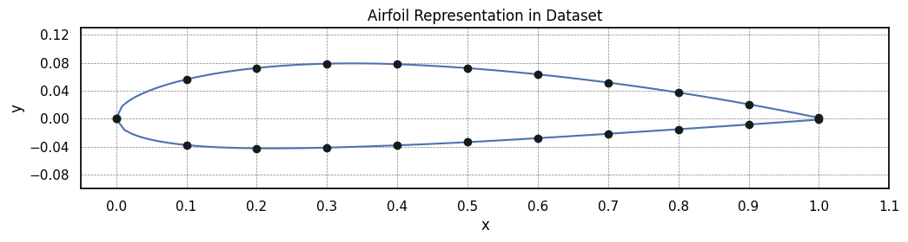
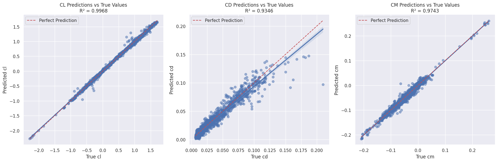
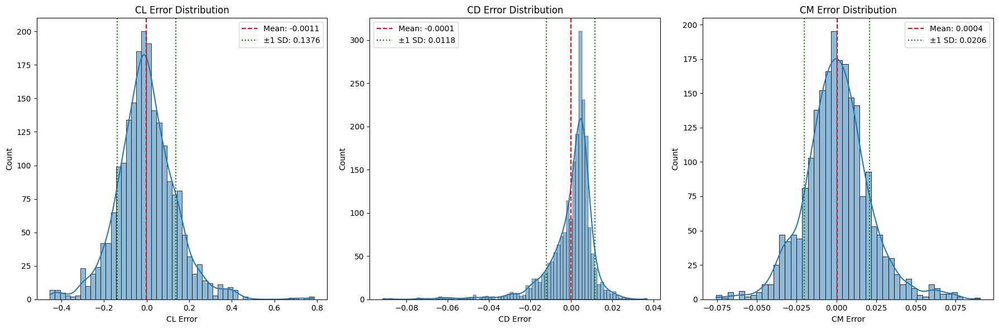

# DeepAerofoil
This project presents a novel machine learning framework for predicting aerodynamic characteristics of airfoils using advanced neural network architectures.It was my tool to apply the Basic Principles of Deep Learning in a topic I appreciate -- Airfoils. Two novel Neural Networks were created in PyTorch (regression model and convolutional neural network) that will predict the Cl, Cd, and Cm of the airfoil based on its shape and other specified conditions like the angle of attack and Reynolds number. Also the results were compared to a similar project and proved to be more accurate and use extensively less computational time and resources. [[1](https://github.com/vicmcl/deeplearwing/tree/main)]

## 1. Introduction
Traditional computational fluid dynamics (CFD) approaches are computationally expensive and time-consuming, motivating the development of machine learning techniques that can provide rapid and accurate predictions. A Promising alternative that is being explored nowadays is surrogate moddeling. A previous study plotted the image of airfoils then fed it into the model; however, this technique required  extensive amount of resources and time too, losing the only benifit provided by using machine learning in the first place.

### Whats New?
This project introduces simplicity as its key innovation. Instead of using full airfoil images, which require extensive computational resources, this approach uses only the represented points of the airfoil. These points are fed into the model, resulting in more accurate predictions of the aerodynamic coefficients Cl, Cd, and Cm in terms of Absolute Mean Error (AME).

It's easy to get caught up in using complex techniques, but sometimes a simpler approach can yield better results. By tweaking the conceptualization of the problem, this project successfully implements a much more efficient method. Despite using a smaller sample size, the model achieved better accuracy, and the computational efficiency was vastly improved. Whereas the previous approach required a system with 16 GB of RAM and struggled to operate, this method now runs smoothly with just 2 GB of RAM.



## 2. Methodology

### 2.1 Data Acquisition and Preprocessing

#### 2.1.1 Dataset Composition
* **Total Airfoil Samples**: 110 unique airfoil geometries
* **Data Sources**:
   * XFOIL computational simulations
   * [Airfoils Tools](http://airfoiltools.com/) online repository
* **Key Aerodynamic Parameters**:
   * Reynolds Number (Re)
   * Lift Coefficient (Cl)
   * Drag Coefficient (Cd)
   * Moment Coefficient (Cm)
   * Angle of Attack (AoA)

#### 2.1.2 Data Representation Strategies
We developed two distinct data representation approaches to capture airfoil geometries and aerodynamic characteristics:

1. **Regression Model Representation**:
   * Airfoil geometry normalized to 12 representative points
   * Upper and lower surface coordinates mathematically transformed
   * Focused on numerical feature extraction
   * **Advantages**:
     - Reduced computational complexity
     - Simplified feature representation
     - Rapid processing and inference

2. **Convolutional Neural Network (CNN) Representation**:
   * Full coordinate set preservation
   * Two variations explored: 
     a) 20-point sampling (0 → 1, step 0.1)
     b) Complete point cloud representation
   * **Advantages**:
     - Comprehensive geometric information capture
     - Enhanced feature learning capabilities
     - Robust to geometric variations

### 2.2 Neural Network Architectures

#### 2.2.1 Regression Model
* **Architecture**: Fully connected neural network
* **Input**: Normalized geometric features
* **Objective**: Direct coefficient prediction
* **Key Characteristics**:
   * Minimal computational overhead
   * Rapid training and inference
   * Low resource requirements (2 GB RAM)



#### 2.2.2 Convolutional Neural Network (CNN)
* **Architecture**: Convolutional layers with geometric feature extraction
* **Input**: Airfoil coordinate representations
* **Objective**: Comprehensive shape-based coefficient prediction
* **Key Characteristics**:
   * Enhanced feature learning capabilities
   * Deeper geometric information processing
   * Ability to capture complex geometric relationships
 
```python
    def __getitem__(self, idx):
        x = np.array(self.x_coords[idx])
        y = np.array(self.y_coords[idx])

        # Create 2D image from x, y coordinates
        image = np.column_stack((x, y))
        image = image.reshape(1, len(x), 2)  # Dynamic sizing based on the number of points

        if self.transform:
            image = self.transform(image)

        input_params = self.input_params[idx]

        return image, input_params, self.targets[idx]
```

## 3. Results
### 3.1 Regression Model



### 3.2 Convolutional Neural Network




## 4. Model Performance
Compared to the original study by TensorFlow, the results for both Regression and Mathimatical model not only exceeds them, they are much faster.
| MAE | Original Study | Current Cov Results | Current Reg Results |
| :---: | :---: | :---: | :---: |
| Cl | 0.1081 | 0.1017 | 0.0215 |
| Cd | 0.0106 | 0.0078 | 0.0057 |
| Cm | 0.0155 | 0.0154 | 0.0071 |

While it didn't capture the whole geometry of the airfoil, it exceeded the CNN results with only 5 min to train and test.
One Other important factor to consider is the avilability of resources: RAM GB and Time invested.
Validation performance metrics available in training logs

## Acknoledgment
This project was conducted as an independent academic exploration of machine learning techniques in aerospace engineering.

## Resources and Refrences
* [1] DeepLearWing. [link](https://github.com/vicmcl/deeplearwing/tree/main)
* [2] Surrogate Modeling of the Aerodynamic Performance for Transonic Regime. [link](https://github.com/Mohamedelrefaie/TransonicSurrogate/tree/main)
